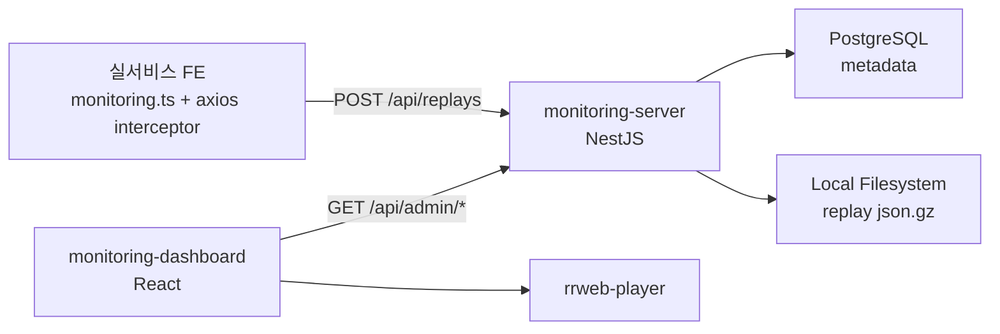

# Backend Technical Requirements Document (TRD)

## 1. 전체 아키텍처

본 시스템은 실서비스 프론트엔드, monitoring-server, monitoring-dashboard로 구성된다.

1. 실서비스 프론트엔드
   - rrweb으로 최근 사용자 화면 이벤트를 메모리에 보관한다.
   - axios interceptor에서 500 에러 또는 network error가 발생하면 error metadata와 replay payload를 monitoring-server로 전송한다.

2. monitoring-server
   - NestJS 기반 백엔드 서버이다.
   - `POST /api/replays`를 통해 에러 발생 시점의 replay report를 수집한다.
   - 검색/필터에 필요한 metadata는 PostgreSQL에 저장한다.
   - rrweb events, recent HTTP requests, 상세 context는 gzip 파일로 local filesystem에 저장한다.

3. monitoring-dashboard
   - React 기반 별도 프론트엔드 대시보드이다.
   - monitoring-server의 `/api/admin/*` API를 호출해 에러 목록, 에러 상세, replay 재생 화면을 제공한다.



### 컴포넌트 구성

#### 실서비스 FE

- `src/lib/monitoring.ts`
- rrweb record 실행
- 최근 1~3분 replay buffer 유지
- axios interceptor에서 500 에러 감지
- user/company/client/http context 수집
- `POST /api/replays` 호출

#### monitoring-server

- tenant/public_key/origin 검증
- error_group upsert
- error_event 저장
- replay gzip 파일 저장
- admin 조회 API 제공

#### monitoring-dashboard

- 에러 목록 조회
- 에러 상세 조회
- replay 조회
- rrweb-player 재생

## 2. 데이터 흐름

1. 실서비스 FE 앱 시작
2. rrweb record 시작
3. 최근 1~3분 이벤트를 메모리에 보관
4. axios interceptor에서 500 에러 또는 network error 감지
5. `POST /api/replays` 호출
6. monitoring-server가 tenant/public_key/origin 검증
7. error_group 생성 또는 기존 그룹 연결
8. error_event 생성
9. replay payload를 json.gz 파일로 저장
10. replay metadata를 PostgreSQL에 저장
11. dashboard에서 GET API로 에러와 replay 조회
12. rrweb-player로 replay 재생

## 3. monitoring-server 기술 스택

```text
Runtime: Node.js
Framework: NestJS
Language: TypeScript 5
DB: PostgreSQL
ORM: Prisma
Storage: local filesystem
Compression: gzip
Deployment: 추후 결정
```

초기 MVP에서는 Redis, MinIO, S3를 사용하지 않는다.

## 4. API 명세

### Public API

```text
POST /api/replays
```

`POST /api/replays`는 에러 발생 시점의 replay report를 생성하는 API이다. 단순 rrweb events만 저장하지 않고 error metadata, user/company context, client context, recent HTTP requests를 함께 수신한다.

#### 역할

- error metadata와 rrweb events를 한 번에 수신
- tenant_id/public_key/origin 검증
- error_group upsert
- error_event 생성
- replay payload gzip 저장
- replay metadata 저장
- replay_id 반환

#### 요청 예시

```json
{
  "tenant_id": "demo",
  "public_key": "pub_demo",
  "session_id": "1716790000000-abc123",
  "version": "3.2.0",
  "environment": "production",
  "page_url": "https://service.example.com/orders",
  "user": {
    "user_id": "u_123",
    "user_name": "홍길동"
  },
  "company": {
    "company_id": "c_001",
    "company_name": "고객사A"
  },
  "error": {
    "type": "http_error",
    "name": "AxiosError",
    "message": "Request failed with status code 500",
    "status_code": 500,
    "request_url": "/api/orders",
    "stack": "...",
    "stack_trace": []
  },
  "client": {
    "browser": {
      "name": "Chrome",
      "version": "125.0.0.0",
      "user_agent": "..."
    },
    "os": {
      "name": "macOS",
      "version": "14.5"
    },
    "device": {
      "type": "Desktop",
      "screen": {
        "width": 1920,
        "height": 1080
      },
      "viewport": {
        "width": 1440,
        "height": 900
      }
    }
  },
  "http_requests": [],
  "replay": {
    "events": [],
    "duration_ms": 120000,
    "started_at": 1716790000000,
    "ended_at": 1716790120000
  },
  "occurred_at": "2026-05-27T10:00:00.000Z"
}
```

#### 응답 예시

```json
{
  "replay_id": "replay_abc123",
  "error_event_id": "event_abc123",
  "error_id": "error_abc123"
}
```

### Admin API

```text
GET /api/admin/errors
GET /api/admin/errors/:id
GET /api/admin/replays
GET /api/admin/replays/:id
```

초기에는 로그인 없이 구현한다. 배포 시에는 IP allowlist 또는 reverse proxy 레벨에서 `/api/admin/*` 접근을 차단한다.

## 5. DB 스키마 초안

### tenants

- id
- name
- slug
- created_at

### api_keys

- id
- tenant_id
- public_key
- allowed_origins
- created_at

### errors

- id
- tenant_id
- fingerprint
- message
- stack
- page_url
- request_url
- status_code
- version
- environment
- first_seen_at
- last_seen_at
- occurrence_count

### error_events

- id
- error_id
- tenant_id
- session_id
- user_id
- user_name
- company_id
- company_name
- message
- stack
- page_url
- request_url
- status_code
- browser_name
- browser_version
- os_name
- os_version
- device_type
- user_agent
- occurred_at
- created_at

### replays

- id
- tenant_id
- error_event_id
- storage_key
- size_bytes
- duration_ms
- created_at

## 6. Replay 저장 방식

초기 저장 위치:

```text
./storage/replays/{tenant_id}/{replay_id}.json.gz
```

DB에는 실제 rrweb events payload를 넣지 않고 storage key만 저장한다.

```text
replays.storage_key = "replays/demo/replay_abc123.json.gz"
```

replay gzip 파일에는 DB에 저장하지 않는 상세 payload를 함께 저장한다.

저장 대상:

- rrweb events
- recent http_requests
- full client context
- full user/company context

## 7. 저장 트랜잭션 정책

1. 요청 payload validation 수행
2. tenant_id, public_key, origin 검증
3. replay payload를 gzip 파일로 저장
4. DB transaction으로 error_group, error_event, replay metadata 저장
5. DB 저장 실패 시 생성된 gzip 파일 삭제
6. 파일 저장 실패 시 DB 저장을 수행하지 않고 500 응답 반환

## 8. 실서비스 FE 연동

실서비스 FE에는 별도 SDK repo를 만들지 않고 파일 하나로 시작한다.

```text
src/lib/monitoring.ts
```

역 역할:

- rrweb record 시작
- 최근 replay buffer 관리
- axios 500 에러 수집
- 최근 HTTP request 이력 관리
- user/company context 수집
- browser/os/device context 수집
- `POST /api/replays` 호출

초기 연동 형태:

```ts
initMonitoring({
  apiUrl: 'http://localhost:4000',
  tenantId: 'demo',
  publicKey: 'pub_demo',
  version: '3.2.0',
  environment: 'development',
});
```

axios interceptor 처리:

1. status >= 500 또는 network error 감지
2. error metadata 구성
3. 현재 rrweb buffer를 함께 `POST /api/replays`로 전송
4. 기존 axios error는 그대로 throw

## 9. monitoring-dashboard 연동

monitoring-dashboard는 React 기반 별도 repo에서 구현한다. 본 BE는 dashboard가 사용할 `/api/admin/*` 조회 API를 제공한다.

화면 route는 다음을 기준으로 한다.

```text
/dashboard/errors
/dashboard/errors/:errorId
/dashboard/replays/:replayId
```

## 10. 보안 정책

### MVP 로컬 단계

- 로그인 없음
- demo tenant seed 사용
- public_key 검증 적용
- public_key는 브라우저에 노출되는 값이므로 secret으로 취급하지 않음
- tenant_id + public_key + origin allowlist 조합으로 요청 검증
- Authorization, Cookie, token, x-api-key 등 민감 header 저장 금지
- request body, response body는 MVP에서 저장하지 않음
- requestHeaders/responseHeaders 저장 시 allowlist 또는 denylist 적용
- rrweb maskAllInputs 적용

### 배포 전 필수

- `POST /api/replays`는 public 허용
- `GET /api/admin/*`는 IP allowlist 적용
- dashboard 접근도 IP 기준 차단
- CORS origin 제한
- payload size limit 적용
- 민감정보 masking 강화
- Docker 배포 시 `./storage`는 persistent volume으로 mount

## 11. 구현 순서

1. monitoring-server NestJS 프로젝트 생성
2. PostgreSQL docker-compose 구성
3. Prisma schema 작성
4. seed tenant/api_key 생성
5. `POST /api/replays` 구현
6. replay payload gzip local 저장 구현
7. 저장 실패/DB 실패 rollback 정책 구현
8. `GET /api/admin/errors` 구현
9. `GET /api/admin/errors/:id` 구현
10. `GET /api/admin/replays` 구현
11. `GET /api/admin/replays/:id` 구현
12. 실서비스 FE에 `monitoring.ts` 추가
13. rrweb record 및 buffer 관리 구현
14. axios interceptor에서 500 에러 감지
15. `POST /api/replays` 연동
16. 로컬에서 500 에러 수집 테스트
17. monitoring-dashboard 생성
18. 에러 목록 화면 구현
19. 에러 상세 화면 구현
20. rrweb-player replay 재생 구현
21. payload limit, masking, retention 추가
22. 배포 환경 결정

## 12. MVP 완료 조건

- 500 에러 발생 시 `POST /api/replays`가 호출된다.
- error metadata가 PostgreSQL에 저장된다.
- replay payload가 gzip 파일로 저장된다.
- dashboard에서 에러 목록을 볼 수 있다.
- 에러 상세에서 replay를 재생할 수 있다.
- PostgreSQL + local filesystem만으로 로컬 MVP가 동작한다.
